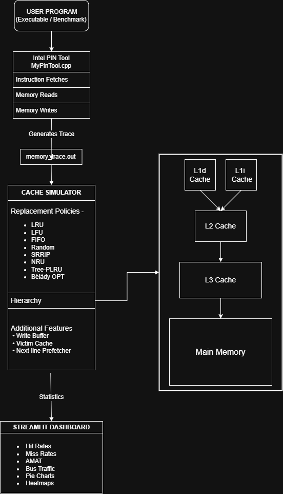
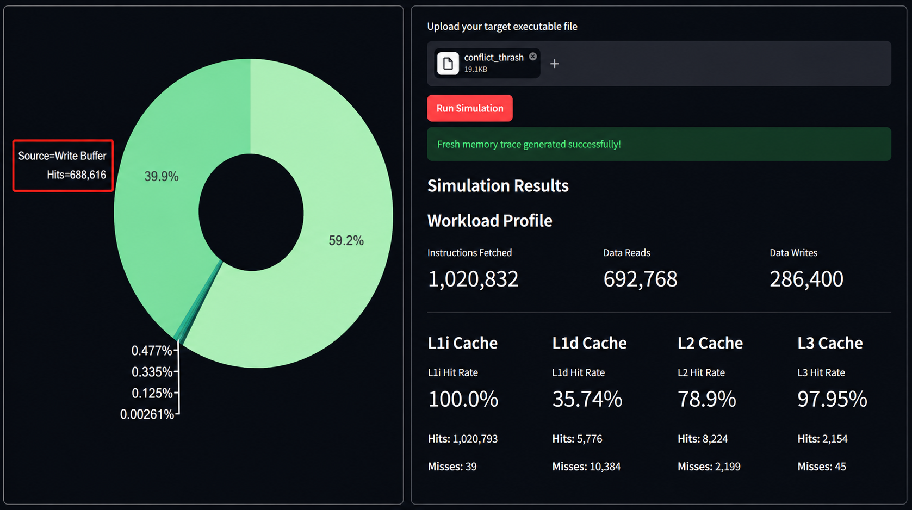
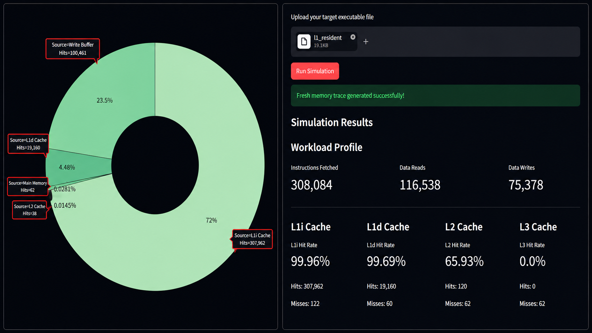
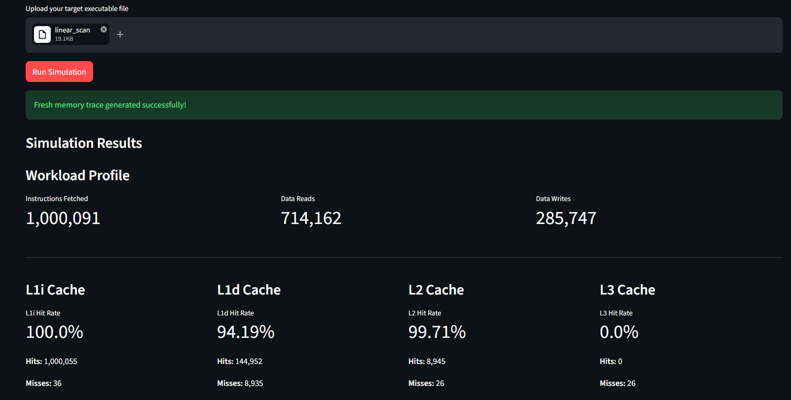

# Multi-Level Cache Simulator with Intel PIN Profiling


A configurable **3-Level Inclusive Cache Simulator** integrated with **Intel PIN** for dynamic memory tracing and a **Streamlit dashboard** for interactive visualization.

The project enables users to profile real executables, generate memory traces, simulate modern cache hierarchies, and visualize memory behavior through hit rates, heatmaps, and workload statistics.

---

## System Architecture



---

## Features

### Cache Hierarchy

* Split L1 Cache

  * L1 Instruction Cache (L1i)
  * L1 Data Cache (L1d)

* Inclusive Cache Hierarchy

---

### Supported Replacement Policies

* LRU
* LFU
* FIFO
* Random
* SRRIP
* NRU
* Tree-PLRU
* Bélády's Optimal (OPT)

---

### Additional Microarchitecture Features

* Write Buffer
* Victim Cache
* Next-line Prefetcher
* Write-through Policy
* Write-back Policy

---

### Intel PIN Integration

The project uses Intel PIN to dynamically trace:

* Instruction Fetches
* Memory Reads
* Memory Writes

The generated trace file (`memory_trace.out`) is then used by the simulator.

---

### Interactive Streamlit Dashboard

The dashboard provides:

* Workload Profile
* Cache Hit/Miss Rates
* Average Memory Access Time (AMAT)
* Bus Traffic Statistics
* Data Resolution Pie Charts
* Memory Access Heatmaps

---
## Tech Stack

| Category                           | Technologies       |
| ---------------------------------- | ------------------ |
| **Programming Languages**          | C++, Python        |
| **Dynamic Binary Instrumentation** | Intel PIN          |
| **Frontend / UI**                  | Streamlit          |
| **Visualization**                  | Plotly, Matplotlib |
| **Operating System**               | Linux / WSL        |
| **Version Control**                | Git, GitHub        |

---

## Repository Structure

```text
Cache-Simulator/

├── README.md
├── .gitignore

├── docs/
│   └── architecture.png

├── screenshots/
│   ├── conflict_thrash.png
│   ├── l1_resident.png
│   └── linear_scan.png

├── cacheSimulator.cpp
├── MyPinTool.cpp
├── webinterface.py

├── conflict_thrash.cpp
├── l1_resident.cpp
└── linear_scan.cpp
```

---

## Example Workloads

### 1. Conflict Thrashing

Demonstrates conflict misses by forcing multiple addresses to compete for the same cache set.

**Expected Behavior**

* Low L1d hit rate
* Heavy Write Buffer usage



---

### 2. L1 Resident Workload

A tiny array remains entirely resident in the L1 cache.

**Expected Behavior**

* Near-perfect L1d hit rate
* Almost no memory traffic
* Extremely low miss rate



---

### 3. Linear Scan

Sequentially scans an 8 MB array.

**Expected Behavior**

* High spatial locality
* High L1 hit rate
* Efficient cache utilization



---

## Installation

### Requirements

* Linux / WSL
* C++17 Compiler
* Intel PIN
* Python 3.8+
* Streamlit

---

### Build Simulator

```bash
g++ -std=c++17 cacheSimulator.cpp -o cacheSimulator
```

---

### Build Intel PIN Tool

```bash
make obj-intel64/MyPinTool.so TARGET=intel64
```

---

### Install Python Dependencies

```bash
pip install streamlit pandas matplotlib plotly numpy
```

---

## Running the Dashboard

```bash
streamlit run webinterface.py
```

---

## Workflow

1. Upload an executable.

2. Intel PIN records:

   * Instruction Fetches
   * Memory Reads
   * Memory Writes

3. Generate:

```text
memory_trace.out
```

4. Run the cache simulator.

5. Visualize:

* Hit Rates
* Miss Rates
* AMAT
* Bus Traffic
* Pie Charts
* Heatmaps

---

## Author

Harshit Sahu

Systems Programming • Computer Architecture • Performance Analysis
